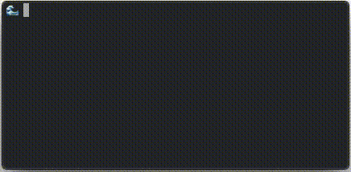
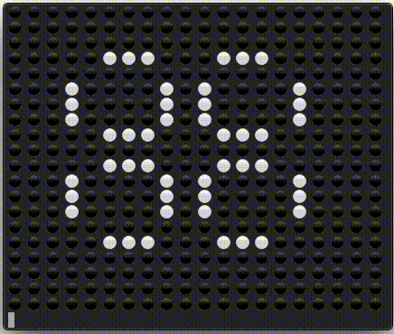
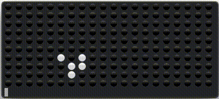
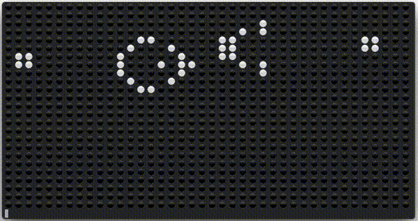

Preamble
========

The following readme is the relevant portion of this repo extracted from a portion of a blog post I
wrote about Conway's Game of Life. You can check out the post and others like it
[here](http://brianyee.ai/posts/game-of-life).

The Game of Life
================

Description
-----------

The Game of Life was introduced by Conway back in
[1970](https://en.wikipedia.org/wiki/Conway%27s_Game_of_Life#Origins). When processing power paled
in comparison today arising to a dearth of wonderful fields out of these restrictions. One of these
fields was called cellular automaton. Cellular automaton are simple systems build out of simple
rules which govern the replication and destruction of cells to form or aim to describe complex
systems. Of these systems likely The Game of Life is known the best. Other famous ones include
[Busy Beaver](https://en.wikipedia.org/wiki/Busy_Beaver_game) or seen images corresponding to a
[Wolfram Code](https://en.wikipedia.org/wiki/Wolfram_code). They are _zero-player games_ meaning
that after the initial configuration the game plays itself out with no intervention from a human.
The rules of Conway's Game of Life are simple and as follows for a square lattice:

1. If a cell has fewer than two neighbouring cells it dies as if by starvation.
2. If a cell has three neighbouring cells it lives as if by procreation.
3. If a cell has four or more neighbouring cells it dies as if by over population.

A cell is defined as the 8 squares that surrounding any square. More tersely they are the cells
that satisfy a [Chebyshev Distance](https://en.wikipedia.org/wiki/Chebyshev_distance) of 1. To
simulate an unbounded universe periodic boundary conditions are employed where cell neighbours can
wrap around the plane in a manner topologically equivalent to a torus. I have shown a regular case
and then one with periodic boundary conditions (PBC) below

```
. . . . . o o o . .
. . . . . o x o . .
p p . . . o o o . p
r p . . . . . . . p
p p . . . . . . . p
```

where `o` corresponds to the neighbours of `x` and `p` corresponds to the neighbours
of`r`. In any finite simulation the choice of boundary conditions are super important. PBC is not
always employed but often enough that this is a perfectly fine choice for now.

Implementation
--------------

The easiest way to calculate each iteration of Conway's Game of Life is to have some board such as
the following


```
0 0 0 0 0 0
0 1 0 0 1 0
0 0 1 0 1 1
```

and simply raster over each state and record the new state

```
0 0 0 0 0 0
0 0 0 1 0 1
0 0 0 0 1 0
```

One can then raster through this array and reassign values to the array that will be have the rules
checked on each cell again. However, this is expensive it is perhaps better to simply reassign the
pointer to the array but this resolves maintaining pointers as well as holding two copies of the
array in memory, each with the state non-obviously tied to each other for a given iteration. An
alternative is simply to only store the cells in which rules would change. This is simple enough, a
check is performed on if a birth or death appears (no need to account for cells that remain in the
same state) and then perform a series of updates on the main array at the end of each iteration.
Our choice for this in Swift is as follows

```swift
func calcUpdates(grid: [[Int]], neighbours: [[[(Int, Int)]]]) -> [(Int, Int)]{
    /*
     Calculates cells that need to be updated according to Conway's Game of Life rules.


     Arguments:
         grid
             Array of boolean integer values.
         neighbours
             Neighbours according to Conway's Game of Life.

     Returns:
         updates
             Cells which according to Conways Game of Life rules would be updated at the
             next iteration.
     */
    var updates = [(Int, Int)]()
    let num_rows = grid.count
    let num_cols = grid[0].count

    for i in 0...num_rows-1 {
        for j in 0...num_cols-1 {
            var alive_cells = 0;
            for (p, q) in neighbours[i][j] {
                alive_cells += grid[p][q]
            }

            let birth = (grid[i][j] == 0 && alive_cells == 3)
            let death = (grid[i][j] == 1 && alive_cells != 2 && alive_cells != 3)
            if birth || death {
                updates.append((i, j))
            }
        }
    }

    return updates
}
```

where the neighbours array is a constant array initialized at the start to calculate the
coordinates of neighbours to avoid redundant computation on each iteration cycle

```swift
func defineNeighbours(num_rows: Int, num_cols: Int) -> [[[(Int, Int)]]] {
    /*
     Define neighbours at for every cell on a grid.

     Neighbourhood is visualized below

     . . . . . o o o . .
     . . . . . o x o . .
     p p . . . o o o . p
     r p . . . . . . . p
     p p . . . . . . . p

     where `o` correponds to the neighbours of `x` and `p` correponds to the neighbours
     of`r. The case of cell `r` is given to visualize the effect of Periodic Boundary
     conditions.

     Arguments:
         num_rows
             Number of rows to calculate neighbours for.
         num_cols
             Number of columns to calculate neighbours for.

     Returns:
        neighbours
             Adjacent neighbours of every cell arranged in a 2d array.
     */
    var neighbours = [[[(Int, Int)]]]()

    for i in 0...num_rows-1 {
        let east = (i - 1 + num_rows) % num_rows
        let west = (i + 1) % num_rows

        var row_neighbours = [[(Int, Int)]]()
        for j in 0...num_cols-1 {
            let north = (j - 1 + num_cols) % num_cols
            let south = (j + 1) % num_cols

            let cell_neighbours = [
                (east, north),
                (east, j),
                (east, south),
                (i, north),
                (i, south),
                (west, north),
                (west, j),
                (west, south),
            ]
            row_neighbours.append(cell_neighbours)
        }
        neighbours.append(row_neighbours)
    }

    return neighbours
}
```

with this array the logic can be more easily segmented into performing flips of state on the
specified booleans at the end of each iteration

```swift
func flipCoords(grid: inout [[Int]], coords: [(Int, Int)]) {
    /*
     Flips specific boolean integers on a grid.

     Arguments:
         grid
             Array of boolean integer values.
         coords
             Coordinates of array elements to be flipped.
     */
    for (i, j) in coords {
        grid[i][j] = 1 - grid[i][j]
    }
}
```

Simulation
==========

Round 1... Begin!
-----------------

Now that we have define the rules let's play around with our system and see what phenomena emerge.

<p style="text-align:center">
    
</p>

God that never gets boring to me. There's something so mesmerizing about the expansion and
contraction of certain shapes. I find it totally amazing to see how sometimes when you are sure the
simulation is going to fizzle out. Is this always the case? No, I'm simply saying

<p style="text-align:center">
    
</p>

Of course I'm not the only one who is entranced by this game. There is a fairly hardcore community
centered around the [LifeWiki](https://www.conwaylife.com/wiki/Main_Page) if you would like to
delve into the culture deeper. Much of the research in the community revolves around constructing
complex systems using well known patterns as building blocks. These building blocks can be sorted
into various classes one of which you can see at the end of this simulation: still lifes, shapes
that remain unchanged between rounds. These static solutions however are not the only building
blocks. There are a few other simple ones I will enumerate here

Blinkers
--------

Blinkers are shapes which follow a series of transformations that indefinitely repeat themselves
without translation on the board. An example of a blinker is the pulsar given below

<p style="text-align:center">
    
</p>

Spaceships
----------

Spaceships are similar like blinkers differing only in the fact that after their series of patterns
completes a cycle the shape will have translated across the board.

<p style="text-align:center">
    
</p>

Infinite Generators
-------------------

Conway originally conjecture that a pattern cannot grow in definitely and offered a 50 dollar
reward if the problem could be solve by 1970. Gosepl et al claimed the prize by creating a system
which emits gliders every 30 iterations except for the first which occurs in 15 iterations.

<p style="text-align:center">
    
</p>

Summary
=======

After an inward look we have taken our first steps to padding our development skills towards app
building by selecting Swift as a language to learn. As a playground to learn with we explored the
beautiful patterns that arise out of Conway's Game of Life, a zero player game founded on four
simple rules applied on top of a square lattice. Some implementation notes were given on how to
effectively employ periodic boundary conditions and used to create various well known patterns that
occur within the game. If any of these gifs were at all mesmerizing to you, I strongly encourage
you to write your own implementation of Conway's Game of Life in any language of your choosing. It
is a timeless joy that has captured the interest of many mathematicians and computer scientists.
With [new exciting developments](https://www.conwaylife.com/wiki/Sir_Robin) still occurring, like
the Turing problem, it is impossible to say when this game will halt in bringing new, interesting,
and exciting developments.
